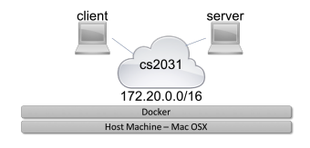
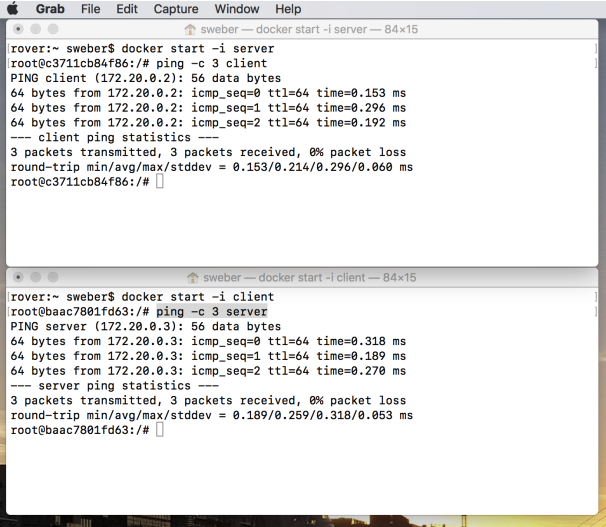
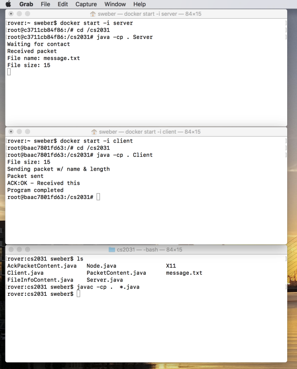
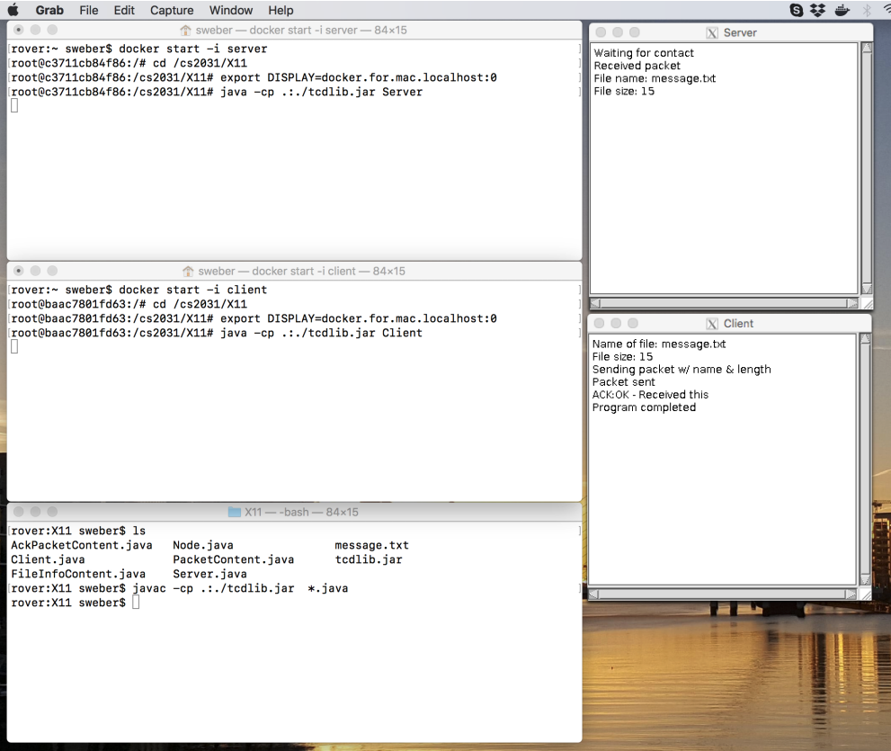
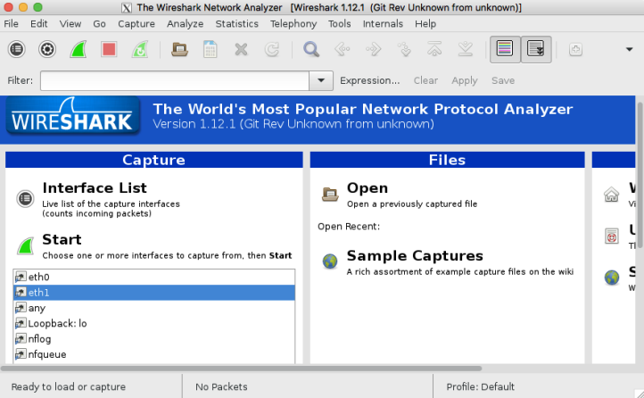
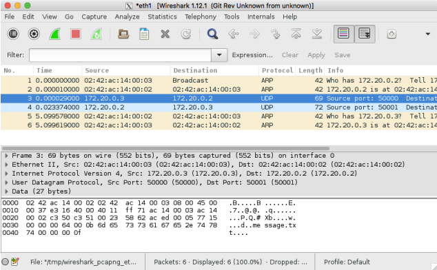
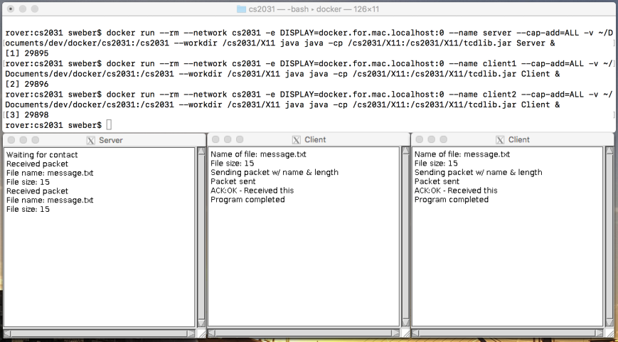

# CS2031 Telecommunication II - Docker Walkthrough
**Disclaimer**: The use of Docker for the assignments is optional – All assignments can be implemented and
run on personal laptops or computers in the labs as well. No one will be penalised for not using Docker for
the assignments.

## 1 Introduction
Docker [[1](https://www.docker.com)] provides an implementation of containers, a virtualisation abstraction that might be described as
light-weight virtual machines - I will omit a detailed discussion of containers here and leave it to the reader
to read up on containers and shell commands where necessary. For the context of CS2031, containers and the
implementation of networking between containers facilitates experimenting with applications in a simulated
networked environment on a local machine.

Figure 1 gives an overview of the topology that we will create in this walkthrough, consisting of two containers,
client and server, which are connected to a simulation of a network, cs2031, provided by Docker.

<p align="center">
  
  <br />
  <i>Figure 1: The small example topology for this walkthrough will consist of a network
and two containers that are attached to the network.</i>
</p>


The following is an overview of the steps to execute the example code on Docker; the steps 2 to 4 will be
discussed in more detail in the following sections:
1. Install Docker from https://www.docker.com
2. Create a network
3. Create two containers
4. Connect the containers to the network
5. Start containers and execute programs

<br>

## Creating a Network & Containers
Docker provides a mechanism to create a subnetwork on a local machine. The descriptions below are based
on Docker on Mac OSX; however, the commands for Docker on Windows or Linux should be the same or
similar.

The first command in listing 1 will create a small bridged network called cs2031. This network will use
IPv4 addresses from the range 172.20.0.0 - 172.20.255.255. The 2nd and 3rd line create two containers called
client and server based on the ”java” image, mount a directory from your host machine called ” /dev/cs2031”
under ”/cs2031” and start ”/bin/bash” when the container is run. The 4th and 5th line will connect the
two containers to the network cs2031.

1. ```zsh
docker network create −d bridge −−subnet 172.20.0.0/16 cs2031
```
3. ```zsh
docker create −−name client −ti −v /dev/cs2031:/cs2031 java /bin/bash
```
4. ```zsh
docker create −−name server −ti −v /dev/cs2031:/cs2031 java /bin/bash
```
6. ```zsh
docker network connect cs2031 client
```
7. ```zsh
docker network connect cs2031 server
```

**Listing 1:** *The following commands will set up a network, create two containers called
client and server, and connecting these containers to the network.*


At this stage, you should be able to start the containers and test some rudimentary communication between
them. The ping program sends packets to given IP addresses or names and reports the roundtrip time of
replies to these packets. Note that Docker provides a resolution of container names to associated IP addresses
i.e. 172.20.0.2 for client and 172.20.0.3 for server.


<p align="center">
  
  <br />
  <i>Figure 2: This screenshot shows two terminals that were used to start the containers
client and server. The ping program was started on both to send 3 packets and report
on the roundtrip time of these packets. Note that Docker allowed the used of the
container names and resolved these names to IP addresses i.e. 172.20.0.2 for client and
172.20.0.3 for server.</i>
</p>

<br>

<span style="color:cyan">```Everything till here is mainstream```</span>


## Starting Containers & Executing Programs

The sample code in the folder with the description for Docker contains an example of a server and client.
The server will open a socket and wait for a connection from a client. It expects a message from the client
about a filename and the length of the file. The client will open file in order to determine its length and
send the filename and the length of the file in a datagram to the server.
Note: The TCD terminal library was developed in the mid 1990s and never adapted to Java Spring. Over
time, the behaviour of how Java handles keyboard input has changed and the terminal exhibits different
behaviour on Windows, on Linux and Mac OSX. For example, the pressing of the shift-key is misinterpreted
on Mac OSX - which complicates the entering of capital letters. The example in the top-level directory
works on the command line and has the name of the file hardcoded. The example in the directory ”X11”
uses the terminal class to open a window for the client and a window for the server, and will require X11.


<p align="center">
  
  <br />
  <i>Figure 3: This screenshot shows 3 terminals executing on the host machine: The 1st
terminal was used to start the container ”server”, the 2nd the container ”client” and
the 3rd shows a compilation of the source code. ”Ctrl-C” ends the server.</i>
</p>


The commands in listing 2 demonstrate how to run the commandline version of the example code. By
starting two interactive containers in individual terminals, you will be able to see the programs executing as
if they were executed on two individual machines. You should see an execution similar to the one shown in
figure 3.

<br>

<span style="color:cyan">In order to get the java files from cs2031 onto docker containers you need to follow these steps:</span>
<ul style="color:yellow">
<li> Download the cs2031.zip from the following <a href="https://drive.google.com/file/d/1cgJ_UrB85ZaKGUzorpHkX3wuL3kdsRNn/view?usp=sharing">link</a>.</li>
<li> Move the cs2031 directory from the local machine to the docker container `docker cp cs2031 (containe_id):/`</li>
</ul>

**Terminals**
1. ```zsh
docker start −i server
$ cd cs2031
$ java Server
```
2. ```zsh
docker start −i client
$ cd cs2031
$ java Client
```

**Listing 2**: *These commands start two interactive containers server and client and
execute the ”Server” and ”Client” programs in them respectively*.


The commands in listing 3 demonstrate the execution of the X11 version of the example code. The difference
to the commandline version is that the X11 version will attempt to open 2 windows based on the TCD
Terminal class. In order to do so, the containers need to know which machine hosts the X11 server to display
on and the X11 server needs to be configured to allow the containers to contact it. The command in line 1
needs to be executed on the host machine to allow Docker to connect to the X11 server on the local machine
and the commands in line 6 and 12 set the DISPLAY variable specific for the Docker installation on Mac
OSX; similar commands should work for Windows and Linux. The commands in line 7 and 13 include a
reference to tcdlib.jar as an addition to the classpath to start the ”Server” and ”Client” respectively. You
should see an execution similar to the one shown in figure 4.

<p align="center">
  
  <i>
  Figure 4: This screenshot shows 3 terminals executing on the host machine: The
1st terminal was used to start the container server, the 2nd the container client and
the 3rd shows a compilation of the source code. The two X11 windows show the
”Server” and the ”Client” after the user entered the filename ”message.txt”. The
client sent the filename and the length of the file and the server replied on receipt with
an acknowledgement.
  </i>
</p>


<br>


<span style="color:cyan">In order to get X11 prompt working you need to install <a href="https://www.xquartz.org/"><b>X-Quartz</b></a> and must restart your pc after installation to get it working.</span>

**Terminals**
1. ```zsh
xhost + 127.0.0.1
```
2. ```zsh
docker start −i server
$ cd cs2031/X11
$ export DISPLAY=docker.for.mac.localhost:0
$ java −cp .:./tcdlib.jar Server
```

3. ```zsh
docker start −i client
$ cd cs2031/X11
$ export DISPLAY=docker.for.mac.localhost:0
$ java −cp .:./tcdlib.jar Client
```

**Listing 3**: *These commands start two interactive containers server and client and
execute the ”Server” and ”Client” programs which make use of the TCD Terminal
class*.

## Capturing Traffic using Wireshark
In order to keep the initial configuration simple, I left out a parameter, ”–cap-add=ALL”, that allows
containers to use capabilities in Linux. The capabilities though are necessary to run wireshark in containers.
The commands in listing 4 show how to remove the existing containers and to create 2 containers with the correct parameters to run wireshark.

1. ```zsh
docker container stop client server
```
2. ```zsh
docker container rm client server
```
3. ```zsh
docker create −−name client −−cap−add=ALL −ti −v dev/cs2031:/cs2031 java /bin/bash
```
4. ```zsh
docker create −−name server −−cap−add=ALL −ti −v dev/cs2031:/cs2031 java /bin/bash
```
5. ```zsh
docker network connect cs2031 client
```
6. ```zsh
docker network connect cs2031 server
```

**Listing 4**: *The following commands will set up the containers with capabilities required
to run wireshark*.


Similar to the execution of the example in X11, the commands in listing 5 start the two containers, client and
server. In this example though, the commands for the server install wireshark and then execute wireshark
to run in the background. The installation of docker will ask for a confirmation that the installation should
go ahead; which should be answered with ’y’[Enter]. After the installation, the configuration script will
ask if wireshark should be enabled for non-root users; which can replied to with [Enter] and ’y’[Enter]. For
simplicity here, wireshark is run by root, so the program will show some warnings which can be ignored for
these examples.

<br>

**Terminals**
1. ```zsh
xhost + 127.0.0.1
```
2. ```zsh
docker start −i server
$ apt−get update
$ apt−get install wireshark
$ cd cs2031/X11
$ export DISPLAY=docker.for.mac.localhost:0
$ wireshark 2>/dev/null &
$ java −cp .:./tcdlib.jar Server
```
3. ```zsh
docker start −i client
$ cd cs2031/X11
$ export DISPLAY=docker.for.mac.localhost:0
$ java −cp .:./tcdlib.jar Client
```

**Listing 5**: *The commands for the server demonstrate how to install and execute
wireshark. The ’&’ causes wireshark to execute as a separate process and the terminal to
continue to accept input. The addition of ”2>/dev/null” sends the output of standard
error, e.g. warning messages etc, to the null device*.


Both containers will show 2 ethernet interfaces eth0 and eth1. The interface eth0 is bound to a default
network and carries for example X11 data traffic. Capturing traffic on this interface will show you a lot
of traffic that may not be very interesting. The interface eth1 is bound to the cs2031 network and should
almost carry no traffic except the traffic that your applications create. Select the eth1 interface in the list of
interfaces and click the green ”shark fin” to start the capture as shown in figure 5.

<p align="center">
  
  <br />
  <i>
  Figure 5: wireshark may show a number of interfaces to capture traffic from. For this
example, select eth1 and start the capture.
  </i>
</p>


Figure 6 shows a sample capture. Start the Client and the Server programs first, then start the capture and
then enter ”message.txt” in the client window. The capture may show a number of other packets e.g. ARP
packets, but these can be ignored for the moment.

<br>

<p align="center">
  
  <br />
  <i>
  Figure 6: The capture shows 6 individual packets; the interesting packets for this
example are packet 3 and 4. Packet 3 is shown in more detail with information about
the Ethernet frame, the IP Packet within the Ethernet frame, the UDP datagram
within the IP Packet and the content of the datagram
  </i>
</p>


## 2 Summary
This short walkthrough should give you the tools to setup small topologies for your assignments, to execute
your own programs on these topologies and to capture the traffic that your own programs will exchange.
This walkthrough is by no means a comprehensive guide to Docker. Docker can be used in a lot of way and
the commands have a lot of options. Figure 7 for example demonstrate how 3 containers, client1, client2
and server, could be started from a one terminal - avoiding the need to open multiple terminals. It is up to
you to explore this environment.

<p align="center">
  
  <br />
  <i>
  Figure 7: The screenshot shows a demonstration of the run command to start 3 containers without the need to open multiple terminals.
  </i>
</p>


## References
[1] Docker Inc. Docker, (accessed August, 2018). https://www.docker.com.